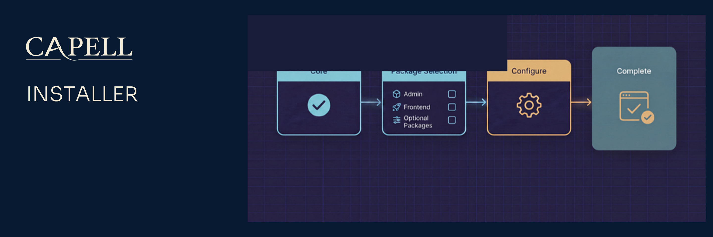

# Capell Installer



[](https://github.com/capell-app/capell/releases/latest)
[](https://packagist.org/packages/capell-app/installer)
[](https://github.com/capell-app/capell/actions/workflows/test-full.yml)
[](https://github.com/capell-app/capell/actions/workflows/code-quality-and-styling.yml)
[](https://app.codecov.io/gh/capell-app/capell/tree/main/packages/installer?components%5B0%5D=installer&displayType=list)
[](#requirements-and-support-policy)
[](#requirements-and-support-policy)
[](https://docs.capell.app)

`capell-app/installer` provides the browser installation workflow for fresh Capell CMS applications. It owns the install routes, progress screens, install guide patches, not-installed dashboard warning, and post-install setup package removal.

Use this package while bootstrapping a new Capell app. It is designed to be removable after setup.

## Package Boundary

Installer owns:

- `/install` browser setup routes and progress/report routes
- Filament install pages and the not-installed dashboard Filament widget
- install guide patch discovery and safe patch application
- first-admin defaults, default package selection, environment preflight checks, and setup package removal

Installer does not own:

- Core install primitives, package manifests, or migration orchestration
- Admin resources beyond installer-specific pages/widgets
- runtime package management or marketplace install authorization
- long-term public or admin runtime behavior after the app is installed

The browser installer works without the Admin panel, but the Filament installer pages and dashboard Filament widget only register when `capell-app/admin` and Filament are present.

## Install

This is the recommended entrypoint for installing Capell. Requiring it pulls in `capell-app/core`; the guided flow then composer-requires the admin and frontend packages you choose and can remove the installer afterwards (`--remove-installer`). Prefer to pick packages by hand? Skip this and require `capell-app/core` (plus `admin` or `frontend` as needed) directly. The complete install guide is published at [docs.capell.app](https://docs.capell.app).

```bash
composer require capell-app/installer
```

Open `/install` in the host app to run the browser flow. The route is guarded by `EnsureNotInstalled` unless reinstall is explicitly allowed. The installer package does not require `capell-app/admin`; selecting the admin package in the installer causes Capell to verify Composer can resolve it, require it during setup, scaffold the Filament panel, and then run the admin integration.

The package config supports these setup env values:

| Env var                         | Purpose                                                                                         |
| ------------------------------- | ----------------------------------------------------------------------------------------------- |
| `CAPELL_SETUP_ALLOW_REINSTALL`  | Allow the browser installer to run on an already installed app. Defaults to `APP_DEBUG`.        |
| `CAPELL_SETUP_COMPOSER_BINARY`  | Composer binary used by installer checks and commands.                                          |
| `CAPELL_SETUP_PHP_BINARY`       | PHP CLI binary used by installer checks and commands.                                           |
| `CAPELL_SETUP_DEFAULT_PACKAGES` | Comma-separated package list selected by default.                                               |
| `CAPELL_SETUP_ADMIN_NAME`       | Prefill the first admin name.                                                                   |
| `CAPELL_SETUP_ADMIN_EMAIL`      | Prefill the first admin email.                                                                  |
| `CAPELL_SETUP_ADMIN_PASSWORD`   | Prefill the first admin password as plaintext input; Capell hashes it when the user is created. |

Treat `CAPELL_SETUP_ADMIN_PASSWORD`, installer progress URLs, and installer reports as bootstrap secrets. Do not commit real setup credentials, and remove or restrict installer access once the app is installed.

Example local demo defaults:

```dotenv
CAPELL_SETUP_ADMIN_NAME="Demo Admin"
CAPELL_SETUP_ADMIN_EMAIL=admin@example.test
CAPELL_SETUP_ADMIN_PASSWORD=password123
```

Do not pass an encrypted or already-hashed value to `CAPELL_SETUP_ADMIN_PASSWORD`. Use the password you want to type on the login form; Laravel stores the hashed password in the `users.password` column during setup.

## Runtime Surfaces

- Provider: `Capell\Installer\Providers\InstallerServiceProvider`
- Config: `config/capell-installer.php`
- Routes: `routes/web.php`
- Controller: `Capell\Installer\Http\Controllers\InstallController`
- Middleware: `Capell\Installer\Http\Middleware\EnsureNotInstalled`
- Pages: `InstallCapellPage`, `InstallGuidePage`, `InstallProgressPage`
- Actions: `GetActiveInstallAction`, `RemoveSetupPackageAction`, `ApplyInstallGuidePatchesAction`
- Patch registry: `Capell\Installer\Support\InstallGuide\PatchRegistry`

The delete-installer route delegates to `RemoveSetupPackageAction`, which removes the setup package from the host app after installation. CLI installs can pass `--remove-installer` for prompt-free removal. Package removal is a final success-only action; failed Composer requirements, Filament scaffolding, package setup, admin integration, or health checks leave `capell-app/installer` installed for retry and debugging.

## Install Guide Patches

Install guide patches are explicit, reviewable changes for common host-app setup tasks. They are the Installer package's main extension point and should be small, idempotent, and safe to re-run.

Patch classes implement `Capell\Installer\Support\InstallGuide\Patch`, live under `Capell\Installer\Support\InstallGuide\Patches`, and are registered through `PatchRegistry`. Keep patch behavior covered by focused tests so a failed patch explains what went wrong instead of leaving a half-edited host file.

The browser installer discovers package and theme choices from Capell package metadata. A package that should appear during setup must be installable by the web PHP process, present in Composer repositories, and described by `capell.json` metadata that the package registry can read. Install-time package selections are checked with Composer before the installer starts mutating the application.

## Verification

Run installer tests after changing installer routes, setup validation, preflight checks, patching, or package removal:

```bash
vendor/bin/pest tests
```

## Requirements And Support Policy

| Surface | Supported versions                          |
| ------- | ------------------------------------------- |
| PHP     | `^8.4`                                      |
| Laravel | Host Laravel `^12.41.1` or `^13.0` via Core |
| Core    | The same release as this package            |

Each Capell 1.x minor receives security fixes for 24 months from its release date, and the latest 1.x minor is always supported. Upgrade all installed Capell foundation packages together to the same supported release before requesting a fix. See the [Capell security policy](https://github.com/capell-app/capell/security/policy) for vulnerability reporting.

Support covers the dependency ranges above. When an upstream release reaches its own end of life earlier, upgrading that dependency may be required to receive a safe fix.

## Troubleshooting

| Symptom                                             | Check                                                                                                                | Fix                                                                                                    |
| --------------------------------------------------- | -------------------------------------------------------------------------------------------------------------------- | ------------------------------------------------------------------------------------------------------ |
| `/install` is unavailable on a fresh app            | `php artisan route:list --name=capell-installer`                                                                     | Confirm the provider was discovered and run `php artisan optimize:clear`.                              |
| `/install` says Capell is already installed         | `InstallerInstallationState::capellIsInstalled()`                                                                    | Use the admin panel, or set `CAPELL_SETUP_ALLOW_REINSTALL=true` only for a controlled local reinstall. |
| Preflight reports the wrong PHP or Composer binary  | `php artisan config:show capell-installer.php_binary` and `php artisan config:show capell-installer.composer_binary` | Set `CAPELL_SETUP_PHP_BINARY` or `CAPELL_SETUP_COMPOSER_BINARY`, then clear config cache.              |
| Optional packages do not appear                     | `composer show vendor/package --available` from the same app                                                         | Fix Composer repositories/auth so the web process can resolve the package.                             |
| Default admin fields are blank                      | `php artisan config:show capell-installer.admin_user`                                                                | Set the `CAPELL_SETUP_ADMIN_*` env values or override the config.                                      |
| Progress says the session expired                   | Check the cache driver and `capell.install.{installId}.*` keys                                                       | Restart the installer with a persistent cache store or use the CLI installer.                          |
| A guide patch fails                                 | Read the patch `reason()` and matching patch test                                                                    | Fix the host file or update the patch probe/apply logic with regression coverage.                      |
| Reports/progress pages remain reachable after setup | `composer show capell-app/installer`                                                                                 | Remove the package or restrict access immediately.                                                     |

## Development

Package development and coordinated verification happen in the [capell-app/capell monorepo](https://github.com/capell-app/capell). Split package repositories are release mirrors; use [docs.capell.app](https://docs.capell.app) for cross-package guidance. See the [contribution guide](https://github.com/capell-app/capell/blob/main/CONTRIBUTING.md), [security policy](https://github.com/capell-app/capell/security/policy), and [licence](https://github.com/capell-app/capell/blob/main/LICENSE.md).

## Further Reading

| Page                                   | Covers                                           |
| -------------------------------------- | ------------------------------------------------ |
| [Installer overview](docs/overview.md) | Installer responsibilities and setup boundaries. |

The complete installation and package-selection guides are published at [docs.capell.app](https://docs.capell.app).
