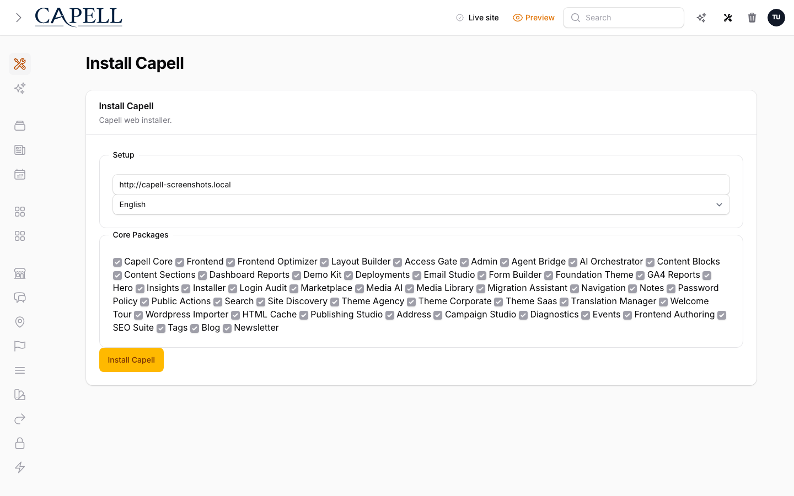
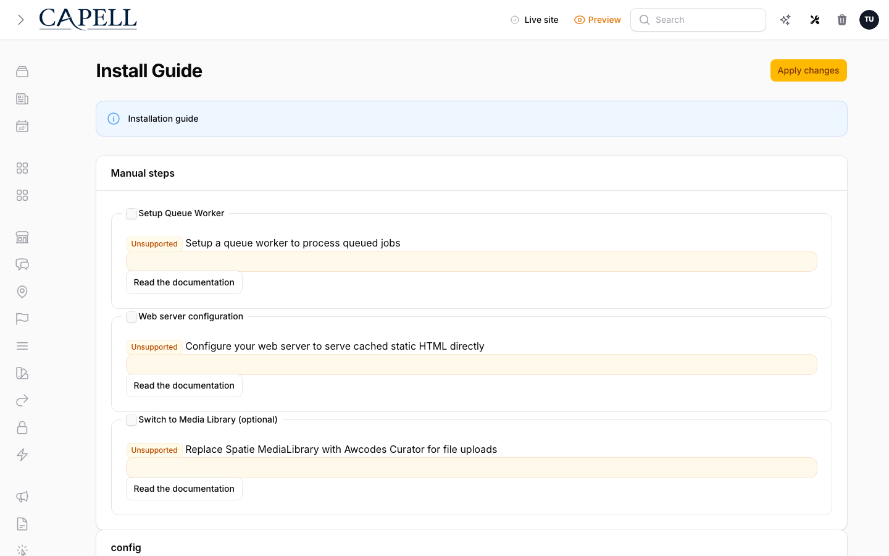

# Capell Installer

## What This Package Adds

**Available. Foundation package. No schema impact. Hidden from Marketplace listings.**

Capell Installer provides the temporary browser setup surface for a new Capell application. It collects install input, runs preflight checks, delegates install work to Core Actions, shows progress and reports, applies install guide patches, and removes itself after setup.

After install, a site operator can open `/install`, select safe setup options, run browser-based setup steps, review progress, download the report, and remove the installer package. The package is intended for bootstrap only; production sites should remove it after setup.

Installer extends these Capell surfaces:

- Public bootstrap routes under `/install` before the site is installed.
- Filament setup pages and dashboard warning while the installer is present.
- Core install Actions through browser step orchestration.
- Install guide patch registry for idempotent host-file setup tasks.
- Cache-backed installer session state for progress, locking, and reports.

## Why It Matters

- **For developers:** Installer keeps bootstrap concerns outside Core. It gives package and app setup a browser flow, preflight checks, patch contracts, typed install input, progress storage, and cleanup Actions.
- **For teams:** Non-technical operators can complete first-run setup with visible checks and reports, while developers still have command-line and testable Action boundaries underneath.

## Screens And Workflow

Screenshot contract:

- Admin index screen: not applicable before setup. Installer may show an Admin dashboard warning while installed.
- Create/edit screen: the `/install` form collects setup input.
- Settings/configuration screen: install guide patches and preflight checks show setup requirements.
- Frontend output: not applicable.
- Package detail or install intent screen: not applicable.
- Carousel steps: setup progress uses browser step requests and progress/report surfaces.

## Technical Shape

- Service provider: `Capell\Installer\Providers\InstallerServiceProvider`.
- Config: installer options, binary paths, reinstall allowance, Composer settings, package defaults, and setup environment values.
- Migrations and models: no package-owned tables or models.
- Filament pages: setup and warning surfaces for installed admin contexts.
- Livewire components: installer UI components for guide and progress behaviour.
- Routes: `/install`, `/install/run-step`, cancellation, progress, progress data, report download, success, and installer deletion routes.
- Policies/permissions: route access is guarded by install state and session ownership rather than normal admin permissions.
- Events/listeners: install progress is reported through Core and installer progress reporters.
- Jobs/queues/schedules: queued install is supported when the host queue is available; browser step mode is the normal flow.
- Blade views/components: installer pages, progress UI, report UI, and guide patch presentation.
- Cache behaviour: install input, plan, progress, locks, and report access use `capell.install.{installId}.*` cache keys.
- Extension hooks: install guide patches implement the Core-owned `Capell\Core\Support\Patching\Patch` contract and register with `PatchRegistry`; install-time patches are also contributed to Core's `InstallPatchRegistry`.

## Data Model

Installer owns no data tables.

Runtime state is cache-backed:

- Install input and plan for the active browser setup.
- Progress lines and status from file and cache progress reporters.
- Lock state that prevents overlapping installs.
- Report access for the browser session that started the install.

Migration impact:

- No Installer migrations.
- Installer delegates schema creation to Core and selected packages during setup.

Deletion and retention:

- Cache entries expire after the configured install window.
- Removing the package deletes the installer code path, not the installed site content.

## Install Impact

- Admin navigation: adds setup-related warning/surfaces only while the installer package is present.
- Permissions: no permanent permissions.
- Public routes: registers bootstrap `/install` routes until the package is removed.
- Database changes: none directly; install steps may run Core and package migrations.
- Config keys: install binaries, reinstall allowance, setup defaults, Composer paths, and package selection settings.
- Queues or scheduled tasks: optional queued install support when the queue is configured.
- Cache tags or invalidation paths: installer progress, lock, input, plan, and report cache keys.

## Common Pitfalls

- `/install` should not remain available after production setup. Remove the package from the success screen or Composer.
- Reinstall is blocked when Admin is installed, the `sites` table exists, and at least one site exists, unless `CAPELL_SETUP_ALLOW_REINSTALL` is true.
- Web PHP must be able to run the configured PHP, Composer, and Git binaries for browser installs.
- Database-backed sessions or cache can fail before tables exist; the provider falls back per request when safe.
- Composer package choices are shown only when the web PHP process can resolve the package.
- Guide patches must be idempotent and covered by focused tests.

## Quick Start

1. Install the package with `composer require capell-app/installer`.
2. Open `/install`, complete preflight checks, run setup, and let the installer delegate to Core.
3. Verify the success report, then remove the installer package from the success screen.

## Next Steps

- Run `vendor/bin/pest packages/installer/tests --configuration=phpunit.xml` after changing installer routes, validation, preflight, patches, session state, or cleanup.
- Run `npm run test:installer-browser` after changing browser flow or CSRF retry behaviour.
- Run `npm run screenshots` and `npm run screenshots:check` after visual installer changes.
- Review patch implementations under `packages/installer/src/Support/InstallGuide`.
