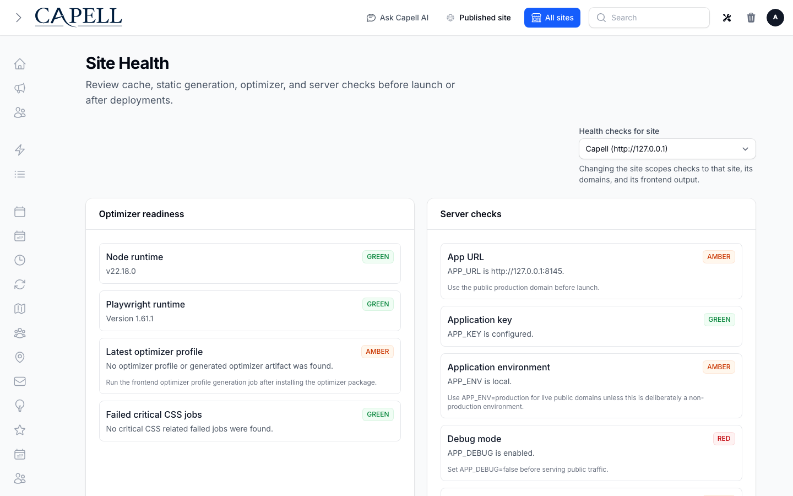

# Screenshot fixture preparation

Capture only through `bash scripts/local-core-screenshots.sh`. The shared runner owns authentication, browser capture and output receipts. A manifest dry run does not establish browser evidence.

The pre-capture hook checks production mode, disabled debug output, file-backed sessions, a default `.example` site domain and compiled Filament CSS. A reused database with a loopback default domain is rejected. Prepare a fresh **owned** workbench before capturing; `prepare-workbench.sh` recreates its screenshot SQLite database and must not be run against another session's workbench.

Frontend entries seed a published editorial page with navigation, article content, a locally stored media illustration and a footer. Its image is editorial artwork, not a product screenshot. The seed rejects placeholder CSS. The admin media-rendering entry uses the same page and media. The ordinary frontend request pipeline renders the page; there is no synthetic screenshot HTML route.

Installer guide entries create the generated host's `.env` only when it is absent. Real environment patches then show an applicable queue setting and an already-applied settings-cache setting. Existing incompatible configuration causes a clear failure rather than being overwritten. The pre-install wizard remains unavailable in this post-install workbench; its optional manifest entry requires a separate pre-install capture phase.

Marketplace gallery entries require two inputs:

- `CAPELL_SCREENSHOT_GALLERY_ROOT`: the read-only source repository containing genuine SEO Suite PNGs.
- `CAPELL_SCREENSHOT_GALLERY_RECEIPT`: its shared-runner receipt report containing at least two distinct accepted light-mode SEO Suite route captures.

The hook validates the receipt report with the declared screenshot-tools validator, checks each PNG signature and SHA-256 digest, and copies those exact bytes into ignored `workbench/database/screenshot-gallery/`. HTTP delivery checks the digest again. It never generates a replacement screenshot or falls back to wireframe artwork. Missing provenance prevents gallery capture. PNGs without matching receipts are insufficient, even if they look plausible.

The Site Health checks retain full filesystem locations when `app.debug` is enabled. Production reports use logical `storage/` and `public/` paths, including when those directories are configured outside the application root. Status, timestamp and remediation remain visible.

This existing development capture illustrates the environment warnings that fixture preparation must resolve. It is not evidence that a fresh production-mode capture has passed the checks above.

The record-state pages, layouts and media redirect routes are intentional test helpers: permission tests exercise them directly. Capture manifests continue to use the canonical Filament list URLs, with data initialised by the pre-capture hook. The two page-building-blocks redirect routes accommodate the runner's admin URL prefix. All fixture classes are reached by a route, the provider or the pre-capture hook.
